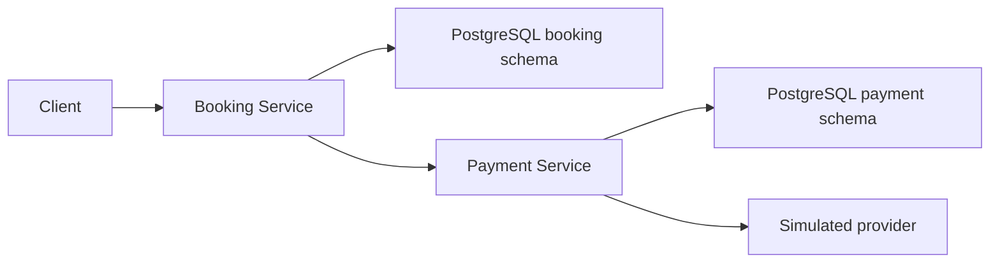

# Eventim High-Concurrency Booking Engine

A Java 17, Spring Boot, and PostgreSQL ticket-booking exercise focused on
concurrent seat allocation, idempotent payments, and recovery across external
calls.

## Guarantees

- Multi-seat holds succeed completely or not at all.
- Fixed-order row locking prevents double booking and reduces deadlocks.
- Reservation creation snapshots the authoritative amount and event currency.
- Checkout never holds a database transaction open during an external call.
- Payment and refund retries reuse one reservation-scoped aggregate.
- Expiry, cancellation, late completion, and refund recovery are durable.
- Database constraints reject invalid reservation, seat, and payment states.

## Design



Both services are stateless; PostgreSQL is the source of truth. Kubernetes can
run two replicas of each service without in-memory coordination.

### Reservations and checkout

Reservation creation locks every requested seat in a stable order, verifies
that all are `AVAILABLE`, and stores the seat-price total plus the event
currency. Checkout then uses that immutable reservation snapshot while locking
seat rows only for ownership and transition safety.

| From | To | Trigger |
| --- | --- | --- |
| New | `HELD` | All requested seats are locked and available |
| `HELD` | `EXPIRED` | Hold deadline passes |
| `HELD` | `PAYMENT_PENDING` | Checkout starts |
| `PAYMENT_PENDING` | `PAYMENT_PENDING` | Provider is still processing |
| `PAYMENT_PENDING` | `BOOKED` | Matching payment succeeds |
| `PAYMENT_PENDING` | `PAYMENT_FAILED` | Payment fails or cancellation succeeds |
| `PAYMENT_PENDING` | `REFUND_REQUIRED` | Successful payment cannot be applied safely |
| `PAYMENT_PENDING` | `REFUNDED` | Payment was already refunded |
| `REFUND_REQUIRED` | `REFUNDED` | Refund succeeds |

Reservation status alone selects the next checkout operation:

| Status | Operation |
| --- | --- |
| `PAYMENT_PENDING` | Create or return the payment |
| `REFUND_REQUIRED` | Create or return the refund |
| `BOOKED`, `PAYMENT_FAILED`, `REFUNDED` | Return the stored response |
| `EXPIRED` | Return HTTP 409 after committing expiry |

A `PROCESSING` payment returns `PAYMENT_PENDING`; it never starts another
charge. Only `REFUND_REQUIRED` triggers a second external operation.

### Payments and refunds

| From | To | Trigger |
| --- | --- | --- |
| New | `PROCESSING` | Charge starts |
| New | `CANCELLED` | Cancellation arrives before a charge |
| `PROCESSING` | `SUCCEEDED` | Provider confirms the charge |
| `PROCESSING` | `FAILED` | Provider rejects the charge |
| `PROCESSING`, `CANCELLATION_PENDING` | `UNKNOWN` | Local completion is interrupted and provider outcome is unknown |
| `PROCESSING` | `CANCELLATION_PENDING` | Cancellation races the charge |
| `CANCELLATION_PENDING` | `CANCELLED` | Cancellation wins |
| `CANCELLATION_PENDING` | `SUCCEEDED` | Charge wins |
| `SUCCEEDED` | `REFUNDED` | Refund succeeds |

`UNKNOWN` is exposed to callers as `PROCESSING` and remains non-terminal until
the provider outcome can be reconciled; timeout alone never implies failure.

Refunds follow `New → PROCESSING → SUCCEEDED/FAILED`; retry moves `FAILED` back
to `PROCESSING` on the same row with the same refund ID.

`payments` contains one row per reservation and serializes payment/cancellation
races with one row lock. A payloadless `CANCELLED` row is a durable tombstone
that prevents a later charge; it is not returned as a normal payment.

Refunds use one separate row per reservation. A failed refund atomically moves
back to `PROCESSING`, keeps the same refund ID, and increments `attempt` so an
older completion cannot overwrite the retry. Existing `PROCESSING` or
`SUCCEEDED` results do not start duplicate provider work.

Booking reconciliation is ordered by `reservations.updated_at`. Payment and
refund `updated_at` values track provider attempts, so polling an existing
`PROCESSING` result cannot postpone interrupted-attempt recovery.

### Persistence

Each service has one final-state Flyway V1 baseline:

- [Booking schema](services/booking-service/src/main/resources/db/migration/V1__create_booking_tables.sql)
- [Payment schema](services/payment-service/src/main/resources/db/migration/V1__create_payment_tables.sql)

`reservation_seats` records the allocation. `seats.reservation_id` intentionally
caches the current owner for simple availability and concurrency checks. Both
are updated in the same transaction.

## API

| Service | Method | Path | Purpose |
| --- | --- | --- | --- |
| Booking | `GET` | `/v1/events/{eventId}/seats` | List availability |
| Booking | `POST` | `/v1/reservations` | Hold seats |
| Booking | `POST` | `/v1/checkout` | Complete checkout |
| Payment | `POST` | `/v1/payments` | Create or return a payment |
| Payment | `GET` | `/v1/payments/by-reservation/{id}` | Reconcile a payment |
| Payment | `POST` | `/v1/payments/cancellations` | Cancel or resolve a payment race |
| Payment | `POST` | `/v1/refunds` | Create, return, or retry a refund |
| Both | `GET` | `/actuator/health` | Health check |

When simulation is enabled, `X-Simulate-Delay-Ms` delays the provider by up to
60 seconds and `X-Simulate-Failure: true` requests a failed operation.

## Run locally

Requirements: Docker Desktop, Docker Compose, `curl`, `jq`, and `uuidgen`.

```bash
docker compose up --build
./scripts/smoke-test.sh
```

The smoke test verifies health, atomic holds, overlap conflicts, successful and
failed checkout, idempotent retry, cancellation tombstones, seat release, and a
failed refund retried successfully with the same ID.

The Flyway V1 seed creates `event-1` with currency `EUR` and twenty seats priced
at `5000` minor units each. Therefore, holding two demo seats produces a
reservation snapshot of `amount: 10000` and `currency: "EUR"`. These are seed
values from the booking V1 SQL, not application configuration defaults.

Stop without deleting data:

```bash
docker compose down
```

If a local database was created using the previous migration chain, recreate
that disposable database or Compose volume because its Flyway history is
incompatible with the consolidated V1 checksum.

## Run on kind with Carvel

Requirements: Docker Desktop, `kubectl`, `kind`, `ytt`, `kbld`, `kapp`, and
`kctrl`.

```bash
./scripts/setup.sh
kubectl port-forward --namespace eventim service/booking-service 8080:8080
```

The setup script creates or reuses the `eventim` kind cluster, installs
kapp-controller, builds and loads both images, installs the Carvel package, and
waits for readiness.

```bash
kctrl package installed get \
  --package-install eventim-booking-engine \
  --namespace eventim-install
kubectl get pods --namespace eventim
```

## Tests

Docker must be running because integration tests use PostgreSQL 17 through
Testcontainers.

```bash
mvn test
```

The 60 tests cover high-contention seat allocation, all-or-nothing multi-seat
holds, expiry commits, reservation price snapshots, checkout states,
idempotency, cancellation/payment races, late completions, and refund retries.

## Demo

## Exercise scope

Customers are anonymous, the provider is simulated, public hosting and database
partitioning are not required, and correctness under concurrency is prioritized
over a fixed throughput target. Reservation creation does not take a
customer-scoped idempotency key because users and authentication are out of
scope; checkout and payment retries are idempotent.
