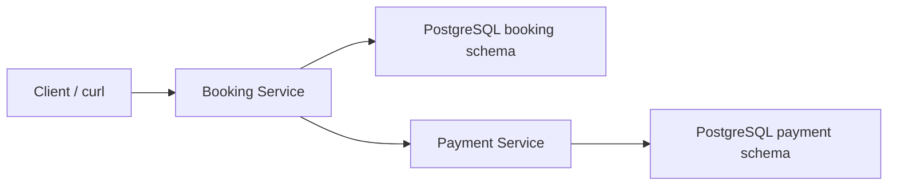

# Eventim High-Concurrency Booking Engine

Production-minded take-home implementation of a high-concurrency event ticketing
engine with Java 17, Spring Boot, PostgreSQL, Kubernetes kind, and Carvel.

## Services

- `booking-service`: seat availability, temporary holds, checkout, and booking state.
- `payment-service`: simulated idempotent payments and refunds.

## Current Implementation Status

This repository is being implemented incrementally. The first milestone is a
working Spring Boot monorepo with database migrations, service health endpoints,
and the core reservation model. The next milestone is the concurrency-critical
seat hold flow using PostgreSQL row-level locks.

## Architecture Direction

The Booking and Payment services are stateless and horizontally scalable. They
coordinate through PostgreSQL, which is the transactional source of truth. Seat
correctness is enforced with row-level locks, state transitions, and unique
constraints rather than in-memory locks.



## Local Prerequisites

- Java 17+
- Maven
- Docker Desktop
- kubectl
- kind
- Carvel tools: ytt, kbld, kapp, kctrl

## Planned Local Commands

```bash
docker compose up -d postgres
```

```bash
mvn test
```

```bash
./scripts/setup.sh
```

Full setup, deployment, curl examples, concurrency trade-offs, and demo steps
will be filled in as the implementation lands.
