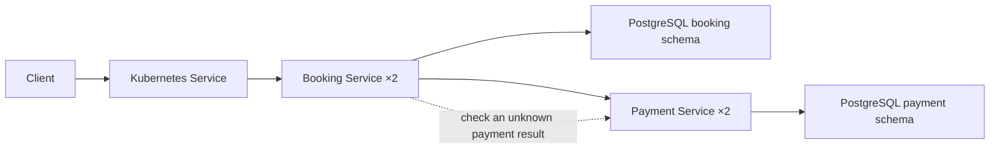

# Eventim High-Concurrency Booking Engine

This project is a ticket booking system built with Java 17, Spring Boot,
PostgreSQL, Kubernetes kind, and Carvel.

The main goal is to protect seats and payments when many customers use the
system at the same time. The system must not sell one seat twice or charge one
reservation twice.

## What is included

- A customer can hold one or more seats for a short time.
- A multi-seat request holds all requested seats or none of them.
- PostgreSQL row locks prevent two customers from holding the same seat.
- Expired holds are released automatically.
- The server calculates the price. It does not trust a price sent by a client.
- Payment and refund requests are idempotent. This means a safe retry does not
  create a second payment or refund.
- The system can recover when a payment response is delayed or lost.
- If payment succeeds but booking cannot finish, the system requests a refund.
- Flyway manages database changes, and database constraints block invalid seat
  states.
- Docker Compose provides a quick local setup.
- Carvel and kind provide a local Kubernetes setup with two copies of each
  service, health checks, resource limits, and persistent PostgreSQL storage.
- Sixteen integration tests cover concurrent reservations and payment edge cases.

## Architecture



The Booking Service and Payment Service do not keep important state in memory.
PostgreSQL is the source of truth. Because of this, a request can go to any
service instance and the same rules still apply.

### How seat reservations stay correct

The Booking Service locks requested seat rows in a fixed order. It creates a
reservation only when every requested seat exists and is `AVAILABLE`.

For example, if a customer asks for seats A-1 and A-2 but A-2 is already held,
the request fails. A-1 is not held on its own. This prevents partial bookings
and also reduces the risk of database deadlocks.

Expired reservations are processed in small batches. `FOR UPDATE SKIP LOCKED`
allows more than one Booking Service instance to run this work safely.

### How checkout stays correct

The Booking Service does not keep a database transaction open while it waits for
the Payment Service. The flow is:

1. Lock the reservation and its seats.
2. Calculate the price from the saved seat prices.
3. Save the reservation as `PAYMENT_PENDING` and finish the transaction.
4. Ask the Payment Service to charge the reservation.
5. Start a new transaction and save the result as `BOOKED` or
   `PAYMENT_FAILED`.

The reservation ID is used as the payment idempotency key. If the same checkout
is sent again, the Payment Service returns the existing payment. It does not
create another charge.

If the payment response is lost or takes too long, the Booking Service keeps the
reservation in `PAYMENT_PENDING`. A background job checks the Payment Service
for the final result. Before applying it, the Booking Service verifies the
amount, currency, and payment-token fingerprint against the stored checkout.
A successful mismatched payment is refunded instead of booking seats. The
client can also retry the same checkout safely.

If no payment is found after the reconciliation timeout, the Booking Service
asks the Payment Service to cancel the reservation-scoped payment intent. The
Payment Service serializes cancellation with payment creation and completion.
Only a durable cancellation allows the seats to be released; if payment won
the race, its final result is returned and applied instead.

If payment succeeds but the seats cannot be booked, the reservation moves to
`REFUND_REQUIRED`. The system then sends an idempotent refund request.

The Payment Service saves a `PROCESSING` payment before the simulated delay.
Unique constraints on `reservation_id` and `INSERT ... ON CONFLICT` collapse
concurrent payment or refund retries into one durable record. A retry with a
different amount, currency, or payment token is rejected.

### Seat and reservation relationship

`reservation_seats` is the main many-to-many table. It records which seats
belong to each reservation.

`seats.reservation_id` also stores the reservation that currently owns a seat.
This is intentional duplication. It makes the most important availability
checks simple and fast.

Both values are changed in the same database transaction. Database constraints
also enforce these rules:

- `AVAILABLE`: no reservation and no expiry time.
- `HELD`: a reservation and an expiry time are present.
- `BOOKED`: a reservation is present, but there is no expiry time.

`reservation_seats` keeps the reservation history. `seats.reservation_id` shows
only the current owner of the seat.

## API

Booking Service (`:8080`):

| Method | Path | Purpose |
| --- | --- | --- |
| `GET` | `/v1/events/{eventId}/seats` | Show current seat availability and release expired holds for the event |
| `POST` | `/v1/reservations` | Hold one or more seats |
| `POST` | `/v1/checkout` | Pay for and complete a reservation |
| `GET` | `/actuator/health` | Check service health |

Payment Service (`:8081`, internal in Kubernetes):

| Method | Path | Purpose |
| --- | --- | --- |
| `POST` | `/v1/payments` | Create a payment or return the existing payment |
| `GET` | `/v1/payments/by-reservation/{reservationId}` | Find a payment during recovery |
| `POST` | `/v1/payments/cancellations` | Prevent a late payment or return the payment that won the race |
| `POST` | `/v1/refunds` | Create a refund or return the existing refund |
| `GET` | `/actuator/health` | Check service health |

Checkout accepts the payment simulation headers while
`PAYMENT_SIMULATION_ENABLED` is true:

- `X-Simulate-Delay-Ms`: delay the payment response by up to 60,000 ms.
- `X-Simulate-Failure: true`: return a failed payment.

## Run with Docker Compose

You need Docker Desktop with Docker Compose.

```bash
docker compose up --build
```

Example requests:

```bash
curl http://localhost:8080/v1/events/event-1/seats

curl -X POST http://localhost:8080/v1/reservations \
  -H 'Content-Type: application/json' \
  -d '{"eventId":"event-1","seatIds":["A-1","A-2"]}'

curl -X POST http://localhost:8080/v1/checkout \
  -H 'Content-Type: application/json' \
  -d '{"reservationId":"REPLACE_ME","paymentMethodToken":"tok_example"}'
```

Stop the services without deleting the database data:

```bash
docker compose down
```

## Run on kind with Carvel

You need Docker Desktop, `kubectl`, `kind`, `ytt`, `kbld`, `kapp`, and `kctrl`.

Run:

```bash
./scripts/setup.sh
```

The script:

1. Creates or reuses the `eventim` kind cluster.
2. Installs kapp-controller `v0.60.1`.
3. Builds the service images with kbld.
4. Loads the images into kind.
5. Creates and installs the Carvel package.
6. Waits until the services are ready.

Open the Booking Service on your computer:

```bash
kubectl port-forward --namespace eventim service/booking-service 8080:8080
```

Check the installation:

```bash
kctrl package installed get \
  --package-install eventim-booking-engine \
  --namespace eventim-install

kapp list --namespace eventim
kubectl get pods --namespace eventim
```

The local installer uses cluster-admin permission because it creates a
namespace and all required resources in a disposable kind cluster. A production
setup should use smaller, pre-created permissions.

## Tests

Docker must be running. The tests use Testcontainers and PostgreSQL 17, and the
build fails rather than silently skipping the suites when Docker is unavailable.

```bash
mvn test
```

The tests check that:

- only one concurrent request can win the same seat;
- an overlapping multi-seat request does not create a partial hold;
- expired holds release their seats;
- successful, failed, repeated, and delayed checkouts work correctly;
- concurrent payment requests create only one payment;
- the same payment key cannot be reused with different payment details;
- mismatched recovered payments are refunded instead of booking seats;
- cancellation tombstones prevent late payments after seats are released;
- refund responses must match the stored reservation and payment;
- stale recovery cannot be overwritten by late payment completion; and
- excessive simulated delays are rejected before work starts.

## Confirmed exercise scope

The following points were confirmed after the assignment questions were sent:

- Customers may remain anonymous. Authentication and reservation ownership are
  not required.
- The required Payment Service is the simulated Java service in this repository.
  An external payment provider is not required.
- A reproducible local deployment with kind, Carvel, and `scripts/setup.sh` is
  enough. Public hosting is not required.
- There is no fixed throughput target. The important requirement is safe
  concurrent behavior without race conditions, double bookings, or inventory
  leaks.
- Database partitioning is not required.

The implementation therefore focuses on concurrency, payment idempotency and
recovery, automated tests, and a reproducible local deployment.

## Possible production enhancements

The current implementation matches the confirmed scope. Any further work should
be based on real product requirements, operating needs, and measured load.
